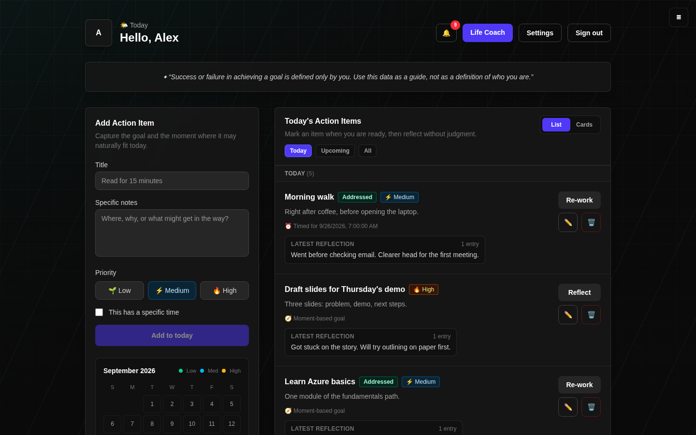
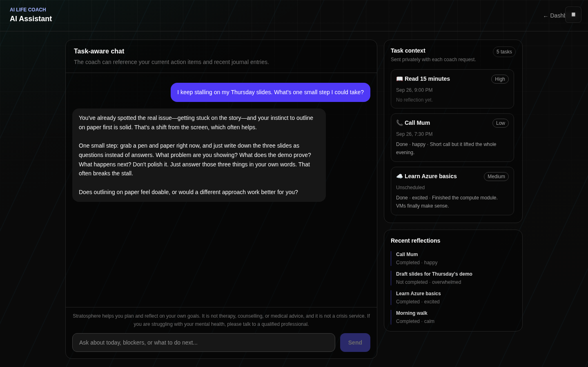
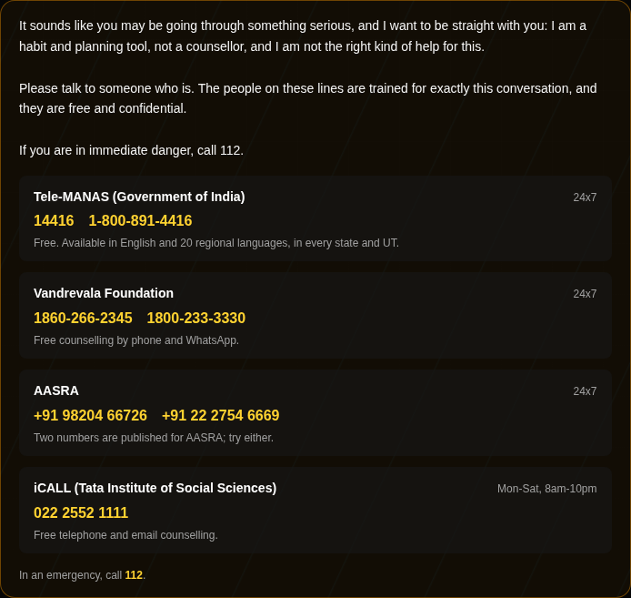
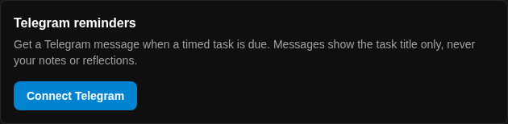

# Stratosphere

**A calmer way to choose, reflect, and finish your day.**

Stratosphere is a habit and planning app for flying above the traffic: pick what matters today, notice how it went, and get a clear next step. It pairs a simple task list with reflections and a task-aware AI coach, and it can nudge you on Telegram when it's time.

The product vision lives in [`ZPROJECT_ASSETS/system-prompt.txt`](ZPROJECT_ASSETS/system-prompt.txt).



> The UI is being redesigned for launch; screenshots show the current build with sample data.

---

## Features

### Plan your day
Add action items with a priority, as either a **moment-based goal** ("after coffee") or a **timed task** with a reminder. A calendar shows what's coming up.

### Reflect without judgment
Log how each task went, whether it's done, and how it felt. Each task keeps its own timeline of reflections, and a missed day is never framed as failure.

### AI life coach
A coach that knows your current tasks and recent reflections. Replies stream in word by word and stay short, warm and practical. Production uses **Claude Haiku 4.5**; local development can use a free **Ollama** model instead.



### Safety first
Stratosphere is a planning tool, not therapy. When the crisis detector flags a chat message, the AI is **never called**: the user gets fixed, human-written guidance and verified Indian crisis lines instead. Flagged reflections are always saved, with the same resources shown alongside them. The detector matches explicit phrases, so it is a safety floor, not a guarantee.



### Telegram reminders
Connect Telegram from **Settings** and get a message when a timed task is due, usually within 30 seconds. Messages contain the task title only, never notes or reflections.



### Built-in spend controls
The paid AI coach is capped per user (50 replies in any 24 hours by default), the conversation history sent with each message is size-limited, and requests are rate-limited per IP. A typical coach message costs about $0.002.

### Web and mobile
A Next.js web app and an Expo (React Native) mobile app share the same FastAPI backend.

---

## Stack

| Layer | Tech |
|-------|------|
| Web | Next.js 16 (App Router), React 19, TypeScript, Tailwind |
| Mobile | Expo 54 (React Native) |
| Backend | FastAPI, SQLAlchemy 2, Alembic |
| Database | PostgreSQL 16 |
| Auth | JWT + bcrypt; HttpOnly cookie (web), bearer token (mobile) |
| AI coach | Claude Haiku 4.5 via the Anthropic API (production), Ollama (local) |
| Reminders | Telegram Bot API |
| Hosting | One Azure Linux VM: Docker Compose + Caddy (HTTPS) |

---

## Run it locally

### Prerequisites
- [Docker](https://docs.docker.com/get-docker/) (for Postgres)
- Python 3.12 and [uv](https://docs.astral.sh/uv/getting-started/installation/)
- Node 20+
- [Ollama](https://ollama.com/download), only if you want the free local AI coach

### 1. Database
```bash
docker compose up -d
```

### 2. Backend (http://localhost:8000)
```bash
cd backend
uv sync
cp .env.example .env
# Set JWT_SECRET: python -c "import secrets; print(secrets.token_hex(32))"
uv run alembic upgrade head
uv run uvicorn app.main:app --reload
```
API docs: http://localhost:8000/docs

### 3. Web app (http://localhost:3000)
```bash
cd frontend
cp .env.local.example .env.local
npm install
npm run dev
```

### 4. Mobile app (optional)
```bash
cd mobile
cp .env.example .env   # set your computer's LAN IP to test on a phone
npm install
npm start
```

### 5. Choose an AI coach
In `backend/.env`, either run locally for free:
```
AI_PROVIDER=ollama
OLLAMA_MODEL=llama3.1:8b      # then: ollama pull llama3.1:8b
```
or use Claude:
```
AI_PROVIDER=anthropic
ANTHROPIC_API_KEY=sk-ant-...   # from console.anthropic.com (separate from a claude.ai subscription)
ANTHROPIC_MODEL=claude-haiku-4-5
```
Restart the backend after changing it.

### 6. Telegram reminders (optional)
1. In Telegram, message [@BotFather](https://t.me/BotFather) and send `/newbot`.
2. In `backend/.env`, set `TELEGRAM_BOT_TOKEN` and `TELEGRAM_BOT_USERNAME` (without `@`), then restart the backend.
3. In the web app, open **Settings → Telegram reminders → Connect Telegram** and press **Start**.

---

## Configuration

Key settings in `backend/.env` (full list in [`backend/.env.example`](backend/.env.example)):

| Setting | Purpose | Default |
|---|---|---|
| `AI_PROVIDER` | `ollama`, `anthropic` or `disabled` | `ollama` |
| `ANTHROPIC_MODEL` | Claude model for the coach | `claude-haiku-4-5` |
| `COACH_DAILY_MESSAGE_LIMIT` | Coach replies per user in any 24 hours (0 = no limit) | `50` |
| `COACH_HISTORY_MAX_CHARS` | Chat history sent with each coach message | `6000` |
| `TELEGRAM_BOT_TOKEN`, `TELEGRAM_BOT_USERNAME` | Telegram reminders; leave empty to disable | empty |
| `SMTP_*` | Password-reset email | empty |

Never commit `.env` files; they are git-ignored.

---

## Tests

```bash
cd backend && uv run pytest tests/unit     # backend tests
cd frontend && npx tsc --noEmit            # web type-check
cd mobile && npx tsc --noEmit              # mobile type-check
```

---

## Deployment

Stratosphere deploys to **Azure**: one Linux VM running Caddy, Next.js, FastAPI and PostgreSQL with Docker Compose. See [docs/deployment/azure.md](docs/deployment/azure.md) for provisioning, networking, TLS, deploys, backups and teardown.

Older AWS, Render and Netlify setups are kept in [`deploy/archive/`](deploy/archive/README.md) for reference only. Note that Netlify stays connected to the repository and keeps building until it is disconnected in the Netlify site settings.

---

## Safety and scope

Stratosphere helps people plan and reflect on their own goals. It is **not** therapy, counselling or medical advice, and it is not a crisis service. The crisis resources are listed in [`backend/app/services/safety.py`](backend/app/services/safety.py) and must be re-verified before every release.

---

## Project layout

```
stratosphere.io/
├── backend/                 FastAPI + SQLAlchemy + Alembic
│   └── app/
│       ├── api/             Routes: auth, me, goals, chat, notifications, support
│       ├── models/          SQLAlchemy models
│       ├── schemas/         Pydantic schemas
│       └── services/        AI coach, safety gate, spend limits, reminders, Telegram
├── frontend/                Next.js web app
├── mobile/                  Expo (React Native) app
├── deploy/
│   ├── Caddyfile
│   ├── azure/               Compose file, env template, provision/bootstrap/deploy scripts
│   └── archive/             Old AWS / Render / Netlify configs (not maintained)
├── docs/
│   ├── images/              README screenshots
│   ├── deployment/azure.md  Azure deployment guide
│   ├── archive/             Old deployment guides
│   ├── history/             Build plan, bug-fix log, past summaries
│   └── notes/               Personal reference notes (git-ignored)
├── ZPROJECT_ASSETS/         Product spec, wireframe, imagery
├── project-icons-images/    App icons (iOS / Android / store)
└── docker-compose.yml       Postgres for local development
```

---

Copyright © 2024 Sivarajan Kakamaniyan. All rights reserved. The source is public for viewing; no licence is granted to copy, modify or redistribute it.
